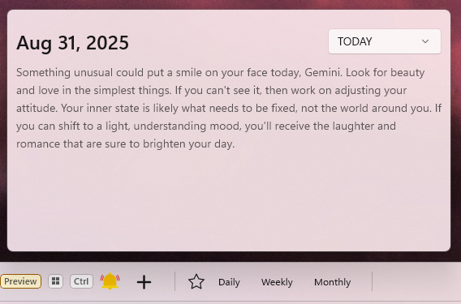
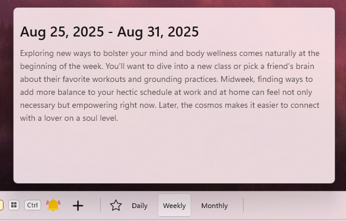
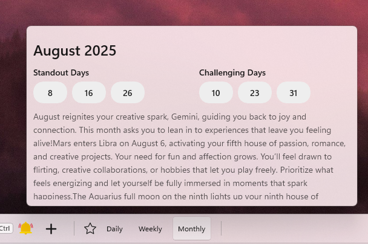
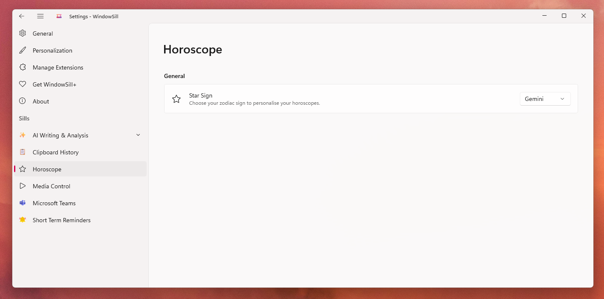

# 🌌 WindowSill Horoscope 

A [WindowSill](http://getwindowsill.app/) extension that brings your **daily, weekly, and monthly horoscopes** right into the 'Command Bar'.  

_Set your star sign once in settings, then check your horoscope anytime with a single click_

## 🖼️ Screenshots

### Tray

### Daily Horoscope Popup

### Weekly Horoscope Popup

### Monthly Horoscope Popup

### Settings

## 🔗 Data Source
Horoscope readings are sourced via [Horoscope-API](https://github.com/ashutoshkrris/Horoscope-API), which in turn scrapes data from [horoscope.com](https://www.horoscope.com).  
- We don’t generate or interpret horoscopes ourselves.  
- This integration simply provides a clean and convenient way to fetch and display them in WindowSill.  